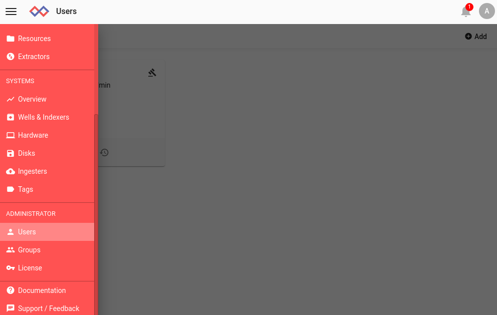
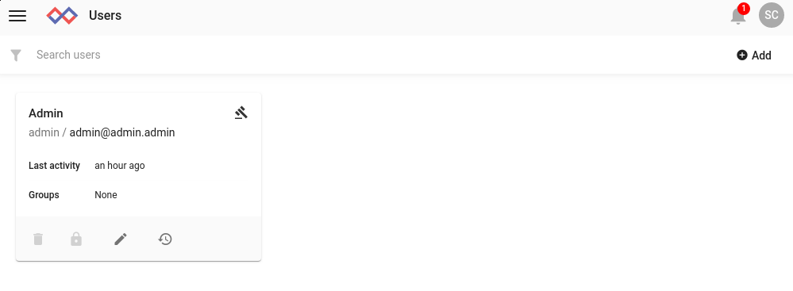
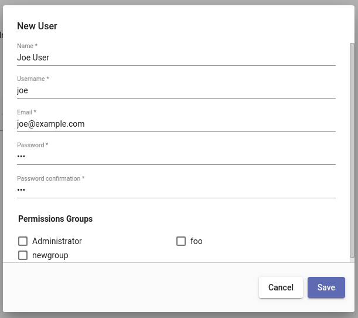
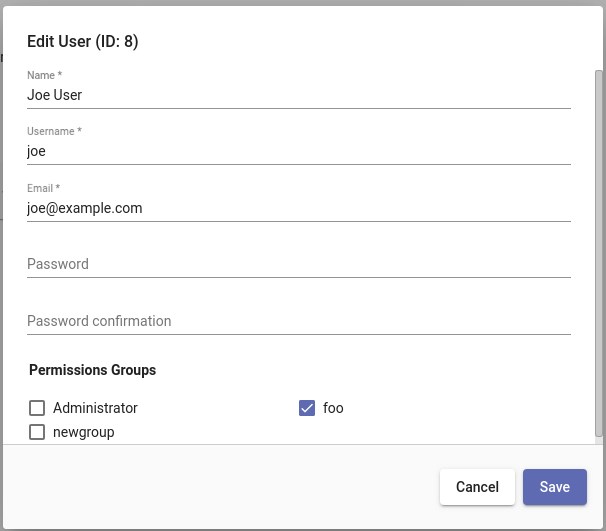
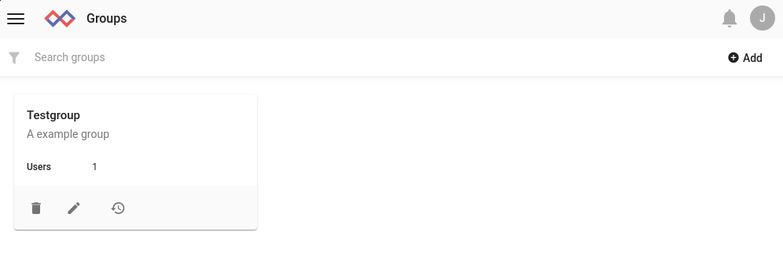
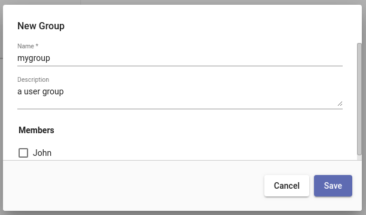
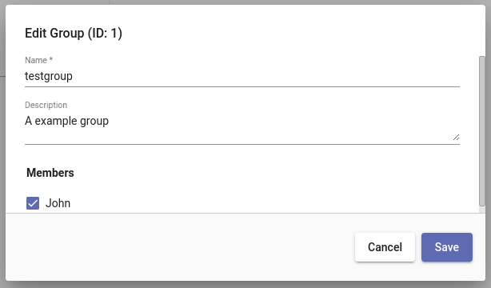

# Managing Users and Groups

Gravwell implements a system of users and groups very similar to Unix's. Each user is assigned a unique user ID number (UID), and each group has a unique group ID number (GID). A given user may belong to zero or more groups.

Resources, dashboards, search results, and other things within Gravwell are typically owned by a user and optionally shared with a list of groups. A resource, for instance, may be owned by UID 3 and shared with several groups, the members of which may read but not modify that resource. Administrator users can read, modify, or delete anything.

The user and group management pages are located in the Administration section of the main menu, near the bottom:

## Managing Users

On a newly-installed system, selecting the Users page should show only one user: the administrator.

### Adding a User

Clicking the 'Add' button brings up a dialog box containing fields to define the new user.

Note the "Permissions Groups" section at the bottom; this allows you to add the user to groups at creation time. Checking the 'Administrator' box will give the user permissions equivalent to the 'admin' user; take great care when making a user an administrator!

### Locking/Unlocking a User Account

Administrators can temporarily disable a user's account by selecting the lock icon on the user's card.

The user will then be marked as "locked" and the lock icon will change to an unlock icon as shown above.

When a user account is locked, the user is immediately logged out of all sessions and cannot log in until the account is unlocked.

### Editing a User Account

Selecting the pencil icon for a user will open a dialog where the account attributes can be changed:

### Viewing a User's Search History

Clicking on the clock icon for a user (in the lower-right corner of the user's tile) will display that user's search history:

From this page the administrator can re-run a given query if necessary; this is useful when debugging problems with users.

### Deleting a User

A user can be deleted by clicking the trash can icon on their user tile. The system will prompt for confirmation before deleting. Note that because deletion is permanent, you should consider locking user accounts as an alternative to deletion; locking the account preserves data associated with that account which may be useful.

## Managing Groups

Selecting the `Groups` page will list any existing groups; by default, Gravwell includes no groups. This screenshot shows a single group:

### Adding a Group

Add a group by clicking the 'Add' button and populating the fields:

Note that you can add existing users to this group at creation time.

### Editing a Group

Clicking on the pencil icon for a group will open a dialog to edit the group. Note that the group name and description can always be changed; groups are internally referenced by GID only.

### Deleting a Group

A group can be deleted by clicking the trash can icon. The system will prompt for confirmation before deletion. Note that after a group has been deleted, its GID will never be reused.