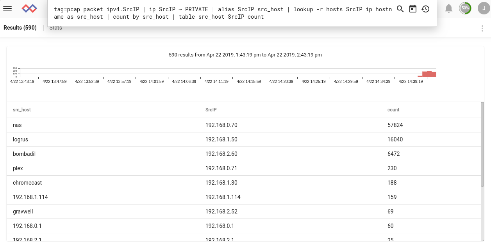

# Alias

aliasモジュールは、既存の列挙値に追加の名前を割り当てることができます。 新しい列挙値を変更しても、元の値は変わりません。これは、ルックアップモジュール用に抽出された列挙値を事前に設定したい場合に特に便利です:

```
tag=pcap packet ipv4.SrcIP | ip SrcIP ~ PRIVATE | alias SrcIP src_host | lookup -r hosts SrcIP ip hostname as src_host | count by src_host | table src_host SrcIP count
```



aliasモジュールは、sourceとdestinationの2つの引数を取ります。 したがって、上記の例では、既存の列挙された 'SrcIP'は 'src_host'にエイリアスされています。 検索モジュールがその結果を 'src_host'列挙値に書き出しても、元の 'SrcIP'値は変更されません。