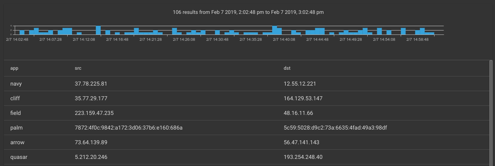

## AX

axモジュールは、他のモジュールの機能を呼び出すことによってデータからフィールドを抽出するために事前抽出規則を使用するラッパーモジュールです。自己記述型、標準型、または構造化されていないデータを使用するクエリを大幅に簡略化できます。

以下のAXプロセッサが使用可能です:

* [CSV](../csv/csv.md)
* [Fields](../fields/fields.md)
* [Regex](../regex/regex.md)
* [Slice](../slice/slice.md)

AXエクストラクタの設定に関する完全なドキュメントについては、[autoextractorセクション](../../configuration/autoextractors.md)を参照してください。

### フィルタリング

axモジュールは、基礎となるプロセッサと同じフィルタ処理セマンティクスを使用して、抽出値に対するインラインフィルタ処理をサポートします。各プロセッサは、フィルタ演算子の特定のサブセットをサポートできます。

たとえば、CSV、fields、およびregexプロセッサは、制限付き等価フィルタ（==！=?！?）をサポートしています。スライスプロセッサは、キャストの種類に応じて特定のフィルタをサポートします。

| オペレーター | 名 | 説明 |
|----------|------|-------------|
| == | 等しい | フィールドは等しくなければなりません
| != | 等しくない | フィールドは等しくてはいけません
| ~ | サブセット | フィールドに値が含まれています
| !~ | サブセットではない | フィールドに値が含まれていません
| < | 未満 | フィールドの数値がより小さい
| <= | より小さいか等しい | フィールドの数値が以下である
| > | より大きい | フィールドの数値がより大きい
| >= | 以上 | フィールドの数値が以上

注：すべての演算子がすべてのプロセッサーでサポートされているわけではありません。複数のタグが同じ名前のフィールドを抽出すると、フィルタ演算子セットは共通のサブセットに制限されます。

### AXの起動

AXモジュールは、複数のカスタムプロセッサで同時に複数のタグを処理できます。  つまり、CSVデータを含む "foo"というタグと、非構造化データを含む "bar"というタグがある場合は、axを使用して両方のストリームを1回の呼び出しでシームレスに処理できます。  これは、2つの異なるデータ形式（CSVと非構造化）の例です:

```
2019-02-07T14:39:21.819693-07:00,cotton,59296,6accf07c-d7fb-4394-b27c-a8fde782e4a7,111.63.178.212,2697,115.152.163.129,1381
2019-02-07T14:39:29.529007-07:00 [calico] <7dee02fa-06a7-493d-812b-54f0d9a33b2b> 7e2:d377:3b3e:669d:b2f9:d311:b99f:f1d6 4462 7a38:8702:357b:9e09:e9ad:959d:1e1a:949 557
```

CSVデータには「testcsv」というタグが付けられ、非構造化データには「testregex」というタグが付けられると想定します。 2つのデータ形式は大きく異なりますが、いくつかの共通データフィールドが含まれています。 データフォーマットごとに、次の自動抽出定義を使用できます:

```
[[extraction]]
	name="regex"
	module="regex"
	tag="testregex"
	params='(?P<ts>\S+)\s\[(?P<app>\S+)\]\s<(?P<uuid>\S+)>\s(?P<src>\S+)\s(?P<srcport>\d+)\s(?P<dst>\S+)\s(?P<dstport>\d+)'

[[extraction]]
	name="csv"
	module="csv"
	tag="testcsv"
	params="ts, app, id, uuid, src, srcport, dst, dstport"
```

AXとaxモジュールを使用して、両方のタグ（ "testregex"と "testcsv"）を指定して共通フィールドを抽出し、それらを単一のビューに統合することができます:

```
tag=testregex,testcsv ax app src dst | ip src as IP | subnet IP /3 | count by subnet | sort by count desc | table -nt subnet count
```


AXは引数を必要としません。  axに引数が与えられていない場合、モジュールは抽出で指定されたすべてのフィールドを抽出します。  同じ抽出設定を持つ同じ2つのデータセットを考えると、非常に単純なクエリを発行できます:

```
tag=testregex,testcsv ax | table
```


与えられたフィルタに一致するエントリだけが欲しいということを指定するためにフィルタリングを追加することもできます:

```
tag=testregex,testcsv ax dstport==80 | table app src dst
```


