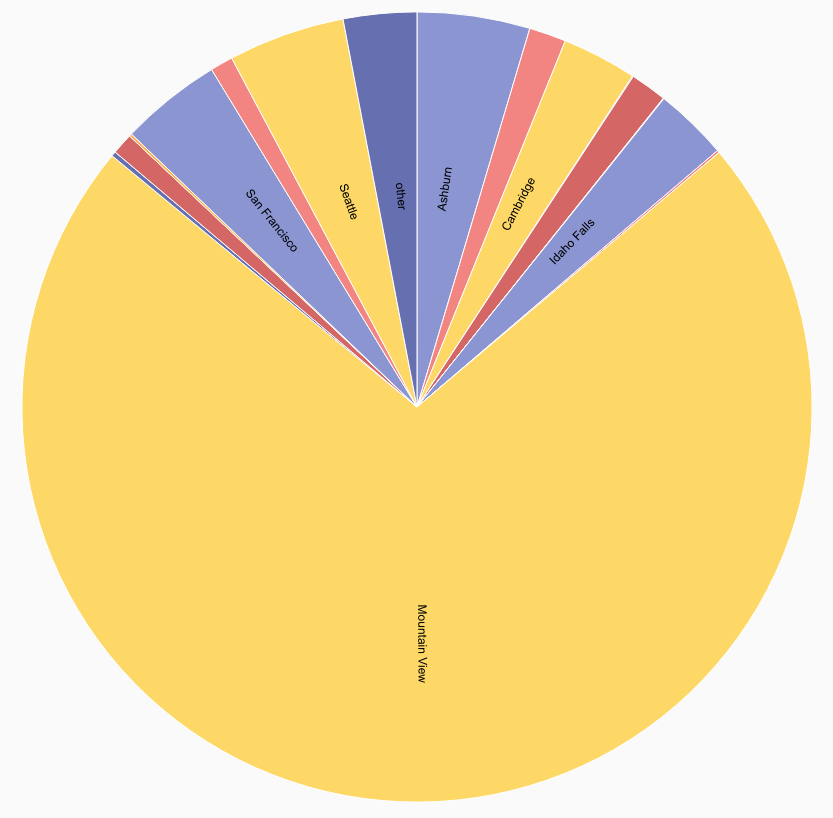
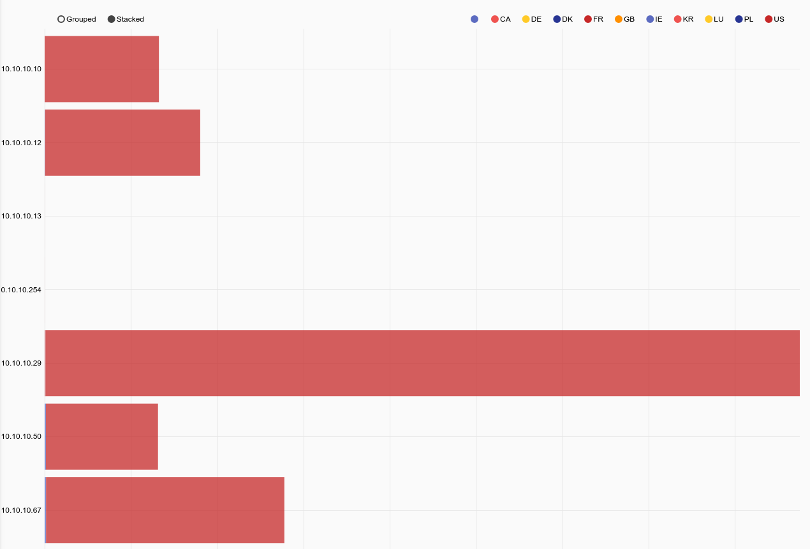

## Geoip

### サポートされているオプション

* `-r <arg>`: “ -r”オプションは、Maxmind geoipデータベースを含むリソース名またはUUIDを指定します。  "-r"が指定されていない場合、geoipモジュールはデフォルトの "maxmind"リソース名を使用します。
* `-s`:-s”オプションは、geoipモジュールが厳密モードで動作することを指定します。  ストリクトモードでは、指定されたオペレータのいずれかがIPを解決できない場合、エントリはドロップされます。

### 処理オペレータ

geoipエクストラクタは、geoipモジュールで非常に高速なフィルタリングを可能にする直接演算子をサポートします。  Tこれらのフィルタは、場所、ISP、所有者などに基づくエントリの高速フィルタリングを可能にします。  各オペレータによってサポートされるフィルタは、抽出されたアイテムのデータタイプによって決定されます。  整数値や浮動小数点数が完全な数値比較演算子をサポートする場合、ISP、国、都市などの文字列は、（!=）と等しい（==）だけをサポートします。  Locationエクストラクタは、経度と緯度の両方で構成されるデータ構造を生成し、フィルタ演算子をサポートしません。  geoipモジュールの1回の呼び出しで複数の演算子を指定でき、出力された列挙値の名前は "as"ディレクティブを使って変更できます。  これにより、1つのエントリで2つのIPアドレスに関連付けられている国を取得し、結果に2つの異なる列挙値を入力できます。

| オペレーター | 名 | 説明
|----------|------|-------------
| == | 等しい | フィールドは等しくなければなりません
| != | 等しくない | フィールドは等しくてはいけません
| < | 未満 | フィールドはより小さい
| > | より大きい | フィールドはより大きくなければなりません
| <= | 以下 | フィールドは以下でなければなりません
| >= | 以上 | フィールドは以上でなければなりません
| ~ | サブセット | フィールドはメンバーでなければなりません
| !~ | サブセットではない | フィールドはメンバーであってはいけません

### データ項目抽出

| 抽出器 | オペレータ | 説明 | 例 
|-----------|-----------|-------------|----------
| ISP | == != | IPアドレスを所有するISP | SrcIP.ISP != Comcast
| Country | == != | IPの国コード | DstIP.Country == "US"
| CountryName | == != | IPの国名 | SrcIP.CountryName != "United States"
| City |  == != | IPの都市名 | DstIP.City
| Continent |  == != | IPの大陸| SrcIP.Continent == NA
| ContinentName |  == != | IP大陸名 | DstIP.ContinentName != "North America"
| TZ |  == != | IPのタイムゾーン | SrcIP.TZ != "MST"
| ASNOrg |  == != | IPの自立システム番号所有組織 | DstIP.ASNOrg != Google
| ASN |  > < <= >= == != | 自立システム番号 | DstIP.ASN >= 1024
| Location |  | IPの緯度/経度 | SrcIP.Location
| Lat | > < <= >= == != | IPの緯度 | DstIP.Lat < 22.5432
| Long |  > < <= >= == != | IPの経度 | DstIP.Long > -15.1234

### 例

#### 国のフィルタリングとその都市の解決の要求

```
tag=pcap packet IPv4.SrcIP ~ 10.0.0.0/16 IPv4.DstIP | geoip -s DstIP.Country == US DstIP.City | count by City | chart count by City
```



#### IP国別トラフィックの表示

```
tag=pcap packet ipv4.SrcIP ~ 10.10.10.0/24 ipv4.DstIP !~ 10.0.0.0/8 ipv4.Length  | geoip DstIP.Country as DestCountry | sum Length by SrcIP,DestCountry | stackgraph DestCountry SrcIP sum
```



#### 2つのIPの都市の抽出

```
tag=pcap packet ipv4.SrcIP ipv4.DstIP | geoip DstIP.City as dest SrcIP.City as src | fdg -b src dst
```
