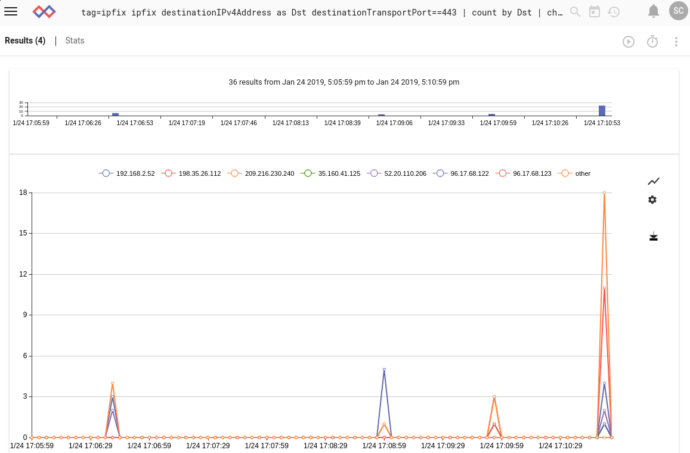

# IPFIX

ipfixプロセッサは、生のIPFIXデータフレームを抽出してフィルタ処理するように設計されているので、ネットワークフローをすばやく識別したり、ポートでフィルタ処理したり、通常は集約フローの動作を監視したりできます。  Gravwellは、オープンソース(https://github.com/gravwell/ingesters)で入手可能な、または[クイックスタートセクション](/#!quickstart/downloads.md)のインストーラーとして利用可能なネイティブのIPFIX + Netflowインジェスターを持っています。

## サポートされているオプション

* `-e`: “ -e”オプションは、ipfixモジュールが列挙値で動作することを指定します。  列挙値を操作すると、アップストリームモジュールを使用してipfixフレームを抽出したときに役立ちます。  生のPCAPからipfixフレームを抽出して、そのフレームをipfixモジュールに渡すことができます。

## 処理オペレータ

各IPFIXフィールドは、高速フィルターとして機能できる一連の演算子をサポートします。  各演算子でサポートされているフィルタは、フィールドのデータ型によって決まります。  数値はすべてをサポートしますが、サブセット演算子とIPアドレスはサブセット演算子だけをサポートします

| オペレーター | 名 | 説明
|----------|------|-------------
| == | 等しい | フィールドは等しくなければなりません
| != | 等しくない | フィールドは等しくてはいけません
| < | 未満 | フィールドはより小さい
| > | より大きい | フィールドはより大きくなければなりません
| <= | 以下 | フィールドは以下でなければなりません
| >= | 以上 | フィールドは以上でなければなりません
| ~ | サブセット | フィールドはメンバーでなければなりません
| !~ | サブセットではない | フィールドはメンバーであってはいけません


## データ項目

ipfix検索モジュールは生のIPFIXフレームを処理するように設計されています。  単一のIPFIXフレームは、ヘッダーとN個のデータレコードで構成されています。  IPFIXとNetflow v5の1つの本質的な違いは、NetFlowのすべてのフィールドが事前定義されているのに対し、IPFIXデータレコードは生成デバイスによって指定されたテンプレートに準拠していることです。  したがって、1つのIPFIXジェネレータがフローの送信元および宛先IP＆ポートを送信する一方、スイッチはパケット数を含むIPFIXレコードを送信するだけです。 

IPFIXヘッダーのすべての要素は、より一般的なデータ要素の一部と同様に、フィルタリングに使用できます。  ヘッダデータ項目をフィルタ処理する場合、フィルタはフレーム内のすべてのレコードに適用されます。  ヘッダデータ項目が最初に処理され、ヘッダーフィルターがフレームをドロップしない場合にのみ、個々のレコードが処理されます。  ipfixプロセッサは拡張モジュールです。  拡張モジュールは入力エントリを複数の出力エントリに分割します。  これは、ipfixモジュールを使うとき、与えられたよりも多くのエントリがパイプラインから出ることができることを意味します。

### IPFIXヘッダーデータ項目

| フィールド |       説明        | サポートされている演算子 | 例 |
|-------|--------------------------|---------------------|---------|
| Version | IPFIXのバージョン、必ず 10 | > < <= >= == != | Version != 0xa
| Length | IPFIXフレームの長さ | > < <= >= == != | Length > 1000
| Sec | センサーデバイスのUnixタイム | > < <= >= == != | Sec == 1526511023
| Sequence | センサーデバイスからのフロー連番 | > < <= >= == != | Sequence == 1
| Domain | ドメイン | > < <= >= == != | Domain == 0x1A

### IPFIXデータレコード項目

どんな与えられたIPFIXフロー記録にも入れることができる多くの可能な分野があります。  [IANA
](https://www.iana.org/assignments/ipfix/ipfix.xhtml#ipfix-information-elements)は何百もの定義をしています。  私たちは最も一般的ないくつかのためにフィルタリングを実装しました：

| フィールド |       説明        | サポートされている演算子 | 例 |
|-------|--------------------------|---------------------|---------|
| octetDeltaCount | Observation Pointでのこのフローに対する着信パケットの前回のレポート（存在する場合）以降のオクテット数。  オクテットの数はIPヘッダーおよびIPペイロードを含んでいます | > < <= >= == != | octetDeltaCount == 80
| packetDeltaCount | 監視ポイントでのこのフローに対する前回のレポート（存在する場合）以降の着信パケット数 | > < <= >= == != | packetDeltaCount == 80
| deltaFlowCount | この集約フローに寄与している元のフローの保守的な数。valueDistributionMethod情報要素によって表現されるメソッドのいずれかを介して配布することができます | > < <= >= == != | packetDeltaCount == 80
| protocolIdentifier | フローのプロトコル番号（TCP = 6、UDP = 17） | > < <= >= == != | protocolIdentifier == 17
| ipClassOfService | IPv4パケットの場合、これはIPv4パケットヘッダーのTOSフィールドの値です。IPv6パケットの場合、これはIPv6パケットヘッダーのTraffic Classフィールドの値です。 | > < <= >= == != | ipClassOfService != 0
| tcpControlBits | このフローのパケットについて観察されたTCP制御ビット。 | > < <= >= == != | tcpControlBits != 0x0004
| sourceTransportPort | フローの送信元ポート。プロトコルにポートがない場合、値はゼロです。 | > < <= >= == != | sourceTransportPort != 0
| sourceIPv4Address | フローのIPv4送信元アドレス | ~ !~ == != | sourceIPv4Address ~ 10.0.0.0/24 
| sourceIPv4PrefixLength | IPv4送信元アドレスプレフィックス長 | > < <= >= == != | sourceIPv4PrefixLength < 24
| sourceIPv6Address | フローのIPv6送信元アドレス | ~ !~ == != | sourceIPv6Address == ::1
| sourceIPv6PrefixLength | IPv6送信元アドレスプレフィックス長 | > < <= >= == != | sourceIPv6PrefixLength < 64
| destinationTransportPort | フローの宛先ポート プロトコルにポートがない場合、値はゼロ | > < <= >= == != | destinationTransportPort != 0
| destinationIPv4Address | フローのIPv4宛先アドレス | ~ !~ == != | destinationIPv4Address ~ 10.0.0.0/24 
| destinationIPv4PrefixLength | IPv4宛先アドレスプレフィックス長 | > < <= >= == != | destinationIPv4PrefixLength < 24
| destinationIPv6Address | フローのIPv6宛先アドレス | ~ !~ == != | destinationIPv6Address == ::1
| destinationIPv6PrefixLength | Pv6宛先アドレスプレフィックス長 | > < <= >= == != | destinationIPv6PrefixLength < 64
| ingressInterface | このフローのパケットが受信されているIPインターフェイスのインデックス | > < <= >= == != | ingressInterface == 1

注: 私たちが使う名前は、netflowやパケットパーサーで使われているものほど短くはありませんが、[仕様で割り当てられている名前](https://www.iana.org/assignments/ipfix/ipfix.xhtml#ipfix-information-elements)と完全に一致します。

上記で指定したフィールドのほかに、[ここ](https://www.iana.org/assignments/ipfix/ipfix.xhtml#ipfix-information-elements)に指定されているように、他の公式IPFIX情報要素名を抽出することもできます（ただし、フィルターはかけません）。  エンタープライズIDとフィールドIDをコロンで区切って指定することにより、非標準フィールドを指定することもできます。  "0x1ad7:0x15"  これをより便利な名前`ipfix 0x1ad7:0x15 as foo`に抽出することをお勧めします。

## 例

### 一定期間にわたるソースIPごとのHTTPSフローの数

```
tag=ipfix ipfix destinationIPv4Address as Dst destinationTransportPort==443 | count by Dst | chart count by Dst
```


