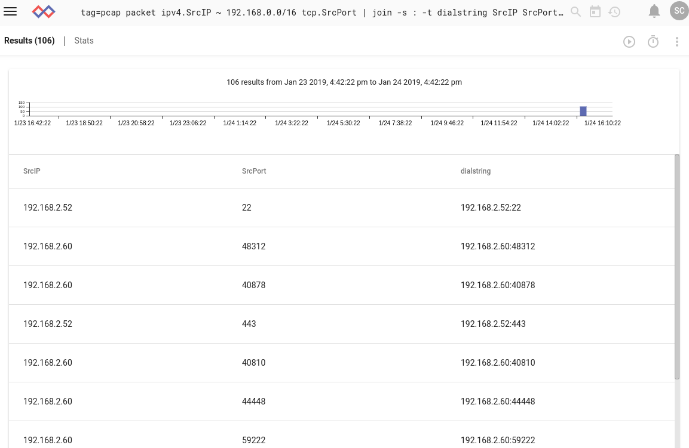

# Join

結合モジュールを使用すると、2つ以上の列挙値を単一の列挙値に結合するのが簡単になります。  バイトスライスにのみ結合できるバイトスライスを除き、列挙型の値はすべて文字列に変換されて連結されます。  バイトスライスは残ります。

次の検索では、netflowレコードから宛先IPとポートを抽出し、それらを区切り文字としてセミコロンで結合して、結果を`dialstring`という名前の列挙値に配置します:

```
tag=netflow netflow Dst DstPort | join -s : -t dialstring Dst DstPort | table Dst DstPort dialstring
```

列挙値はいくつでも指定できます。  `-t`フラグは、「標的」の列挙値を指定します。  指定しない場合は、最初にリストされた列挙値が上書きされます。

## サポートされているオプション

* `-s <separator>`:結果の文字列内の各列挙値の値の間に、指定された区切り文字列を配置してください。  指定しない場合、区切り文字は使用されません。  バイトスライスでは無視されます。
* `-t <target>`: 最初の列挙値を上書きするのではなく、指定された名前の列挙値に結果を格納してください。

## 例

```
tag=pcap packet ipv4.SrcIP ~ 192.168.0.0/16 tcp.SrcPort | join -s : -t dialstring SrcIP SrcPort | unique SrcIP,SrcPort | table SrcIP SrcPort dialstring
```

