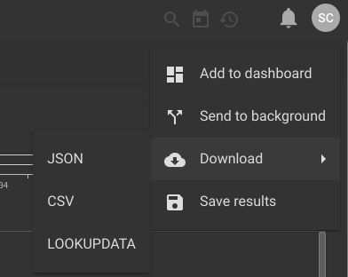

## Lookup

Lookupモジュールは、リソースに格納されている静的データソースからデータの充実と変換を行うために使用されます。

```
lookup -r <resource name> <enumerated value> <column to match> <column to extract> as <valuename>
```

注：構文に ```as <valuename>```の追加を提供しない場合、ルックアップは列挙値をルックアップから抽出した値に置き換えます。

追加の操作をまとめて文字列化することで、lookupモジュールの1回の呼び出しで複数のlookup操作を指定できます。

### サポートされているオプション
* `-r <arg>`: "-r"オプションは、どの検索リソースを使用してデータを充実させるかを検索モジュールに通知します。
* `-s`: "-s"オプションは、検索モジュールが、指定されたすべての操作が成功することを要求することを指定します。
* `-v`: "-v"フラグは、ルックアップモジュール内の制御ロジックを反転します。  つまり、成功した一致は抑制され、一致しなかった一致は渡されます。  "-v"と "-s"フラグを組み合わせて基本的なホワイトリストを作成し、指定されたルックアップテーブルに存在しない値のみを渡すことができます。

### lookupdataリソースを設定する

ルックアップデータは、互換性のあるレンダリングモジュール（例えば、テーブルモジュール）からダウンロードされ、ダウンロードおよび共有および利用のためにリソースに格納され得る。  検索結果ページのメニューを使用して、 "LOOKUPDATA"を選択してこのフォーマットの検索結果の表をダウンロードすることを選択できます。



[テーブルレンダラ](#!search/table/table.md)には `-save`オプションも用意されており、後で検索で使用するために検索結果テーブルをリソースとして自動的に保存します:

```
tag=syslog regex "DHCPACK on (?P<ip>\S+) to (?P<mac>\S+)" | unique ip mac | table -save ip2mac ip mac
```

上記の例では、テーブルレンダラはDHCPログから派生したMACアドレスへのIPアドレスのマッピングを含む `ip2mac`という名前のリソースを自動的に作成します

#### CSV

CSVデータもルックアップモジュールに使用できます。  Gravwell検索検索モジュールでcsvファイルをリソースとして使用するには、CSVに列の一意のヘッダーが含まれている必要があります。

### 検索例

この例では、次のcsvから作成された "macresolution"というリソースを使用します:
```
mac,hostname
mobile-device-1,40:b0:fa:d7:af:01
desktop-1,64:bc:0c:87:bc:71
mobile-device-2,40:b0:fa:d7:ae:02
desktop-2,64:bc:0c:87:9a:11
```

それから、パケットデータの検索を発行し、lookupモジュールを使用してデータストリームを強化し、ホスト名を含めます。  この場合、ホスト名は "devicename"列挙値に割り当てられます。

```
tag=pcap packet eth.SrcMAC | count by SrcMAC | lookup -r macresolution SrcMAC mac hostname as devicename |  table SrcMAC devicename count
```

これにより、次の強化されたデータを含むテーブルが作成されます
```
64:bc:0c:87:bc:71	|	desktop-1       	|	52183
40:b0:fa:d7:ae:02	|	mobile-device-2 	|	21278
64:bc:0c:87:9a:11	|	desktop-2       	|	 2901
40:b0:fa:d7:af:01	|	mobile-device-1 	|	  927
```

#### ルックアップテーブルを使用したホワイトリスト操作の例
```
tag=pcap packet eth.SrcMAC | count by SrcMAC | lookup -v -s -r macresolution SrcMAC mac hostname |  table SrcMAC count
```

これにより、ルックアップリストに含まれていなかったすべてのMACアドレスを含むテーブルが得られます。  システム管理者は、 " - v"と " - "フラグを使用して、ネットワーク上の新しいデバイスまたはイベントストリーム内の新しいログの基本的なホワイトリストと識別を提供できます。
```
64:bc:0c:87:bc:60	|	24382
40:b0:fa:d7:ae:13	|	93485
64:bc:0c:87:9a:02	|	11239
40:b0:fa:d7:af:fe	|	   21
```
