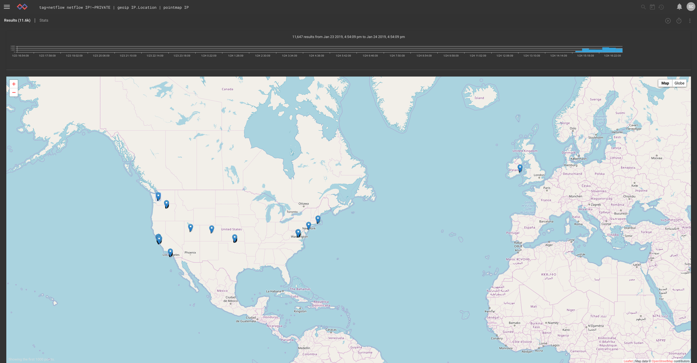
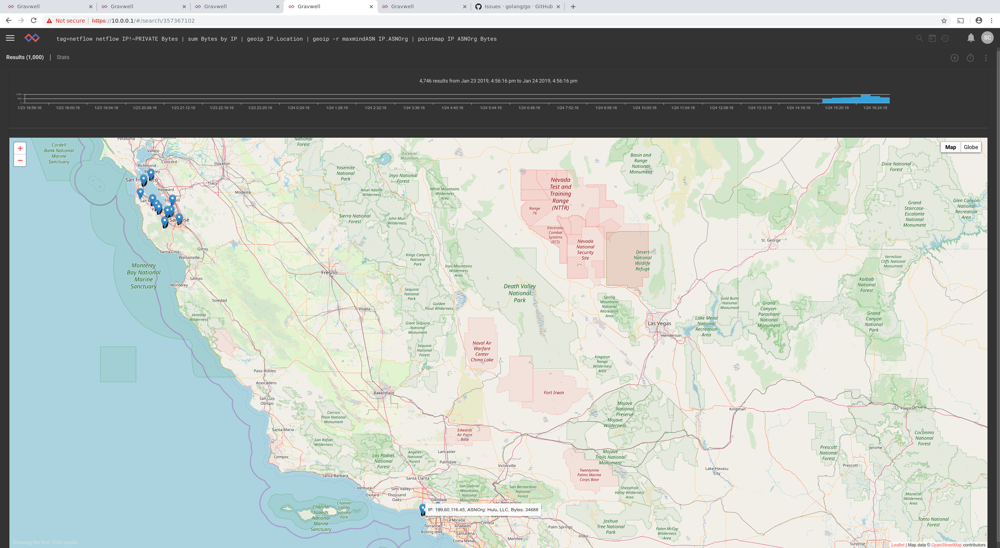
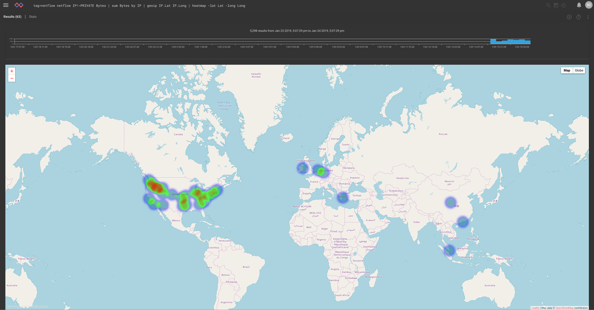
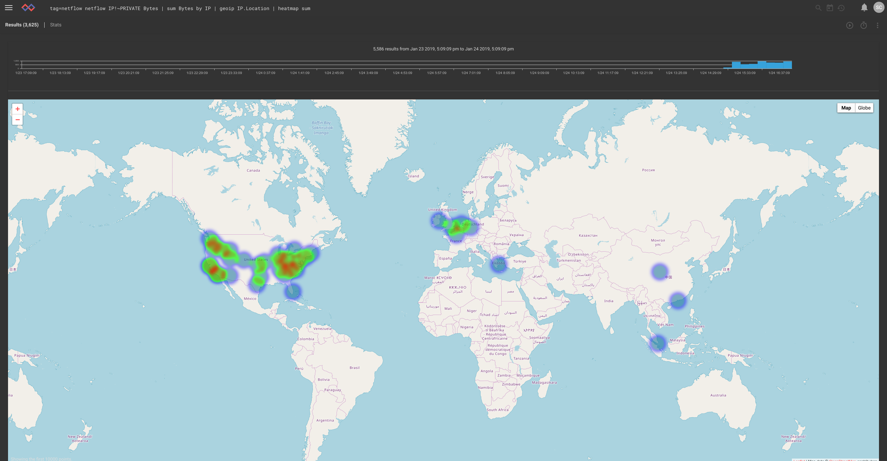
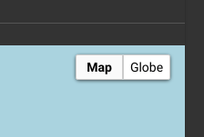
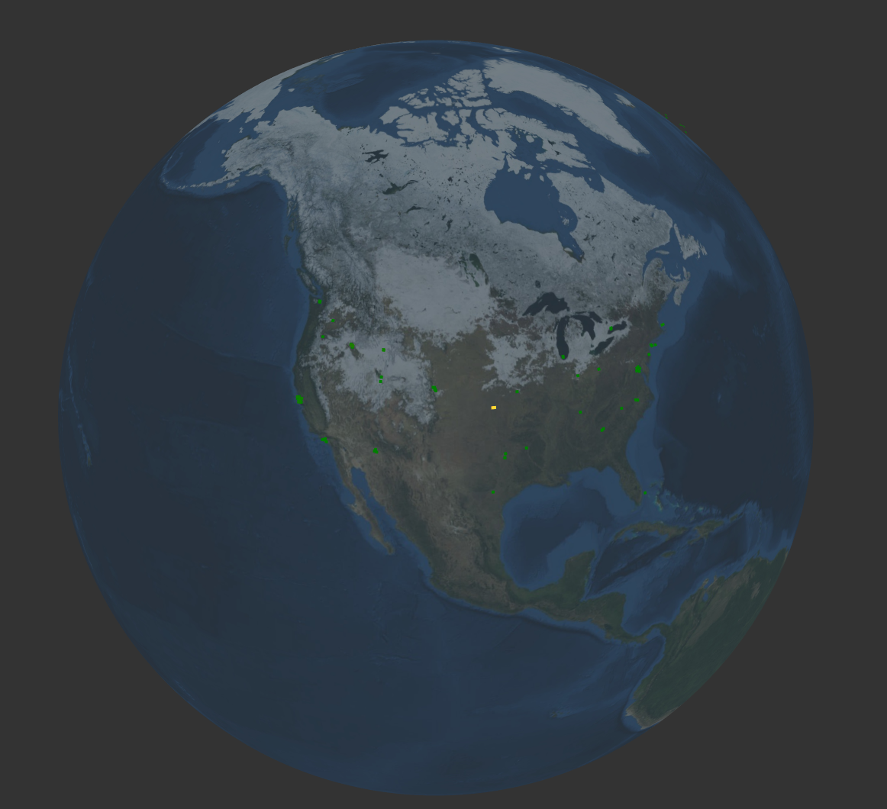
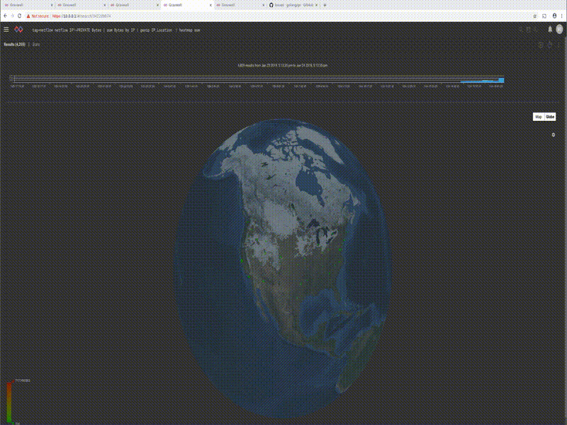

# Map modules

`pointmap`/`heatmap`レンダラモジュールは、マップ上に検索結果を示します。  どちらも列挙値の位置に基づいてマップにエントリを配置します。  デフォルトでは、モジュールは[geoip](#!search/geoip/geoip.md)検索モジュールによって設定された `Location`と呼ばれる列挙値を探します。  場所は、以下を使用して明示的に指定することもできます:

* `-loc <enumerated value>`は、デフォルトの`Location`ではなく、指定された列挙値で場所を探すようモジュールに指示します。
* `-lat <enumerated value> -long <enumerated value>`は、緯度と経度の値を別々に検索するようモジュールに指示します。  これらは、（ `geoip`モジュールによって提供される）浮動小数点数または別のソースからの文字列です

マップには、最大1000ポイントが表示されます。これはジオフェンスです。  つまり、マップの一部にズームインすると、そのエリア内に最大1000ポイントが表示されます。

# Pointmap

ポイントマップはエントリをマップ上の個別のマーカーに変換します。  追加の列挙値名が指定されている場合は、ポイントがクリックされたときにそれらの内容が表示されます。  

次の検索では、netflowレコードに記録されているすべてのIPアドレスのマップが表示されます:

```
tag=netflow netflow IP | geoip IP.Location | pointmap IP
```



各IPからのバイト数を合計し、IPおよびBytes列挙値をポイントマップの引数に追加すると、ポイントをクリックすると表示されます（話しているWHOを確認できるようにASN組織も追加しました）:

```
tag=netflow netflow IP Bytes | sum Bytes by IP | geoip IP.Location | geoip -r maxmindASN IP.ASNOrg | pointmap IP Bytes ASNOrg
```



# Heatmap

ヒートマップはポイントマップと同様に機能しますが、引数として0または1の追加の列挙値を取ります。  列挙値の引数が与えられていない場合は、各場所のエントリ数を`heat`としてヒートマップを生成します。  ネットフローレコードを使用するこの例では、`heat`はロケーションからの接続数を表します:

```
tag=netflow netflow IP | geoip IP.Lat IP.Long | heatmap -lat Lat -long Long
```



合計バイト数を引数として追加すると、`heat`は接続数ではなく、接続を介して送信されたバイト数から導き出されます:

```
tag=netflow netflow IP Bytes | sum Bytes by IP | geoip IP.Location | heatmap sum
```



## 3Dマップ表示

ヒートマップとポイントマップにも3Dレンダリングがあります。  マップの右上にある「Globe」セレクタをクリックするだけでマップが再描画されます。



まったく同じヒートマップクエリを実行しますが、Globeシステムを使用してレンダリングすると、次のようになります:



しかし、もう1つの気の利いたトリックがあります。  すべてのグローバルな脅威についてリアルタイムで確実に更新されていることを知らせるために、ローテーションを追加できます。


