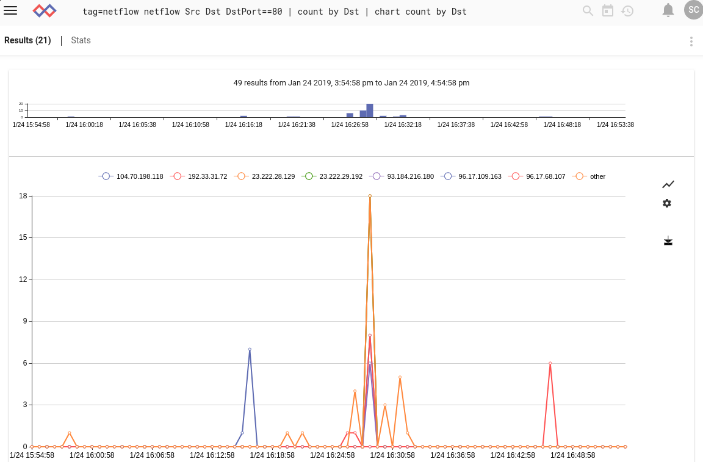
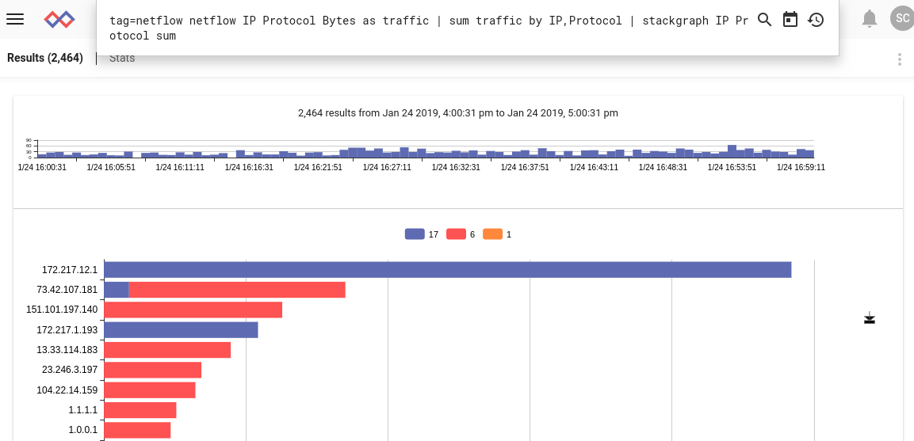

## Netflow

NetFlowプロセッサは、生のNetFlowデータフレームを抽出してフィルタ処理するように設計されているため、ネットワークフローを迅速に識別したり、ポートでフィルタ処理したり、一般的に集約フローの動作を監視したりできます。  Gravwellには、オープンソースでhttps://github.com/gravwell/ingestersから入手できるネイティブクイックフローインジェスターがあります。

### サポートされているオプション

* `-e`: “-e”オプションは、netflowモジュールが列挙値で動作することを指定します。  列挙値を操作すると、アップストリームモジュールを使用してNetFlowフレームを抽出した場合に便利です。  生のPCAPからnetflowフレームを抽出して、そのフレームをnetflowモジュールに渡すことができます。

### 処理オペレーター

各netflowフィールドは、高速フィルタとして機能できる一連の演算子をサポートしています。  各演算子でサポートされているフィルタは、フィールドのデータ型によって決まります。  数値はすべてをサポートしますが、サブセット演算子とIPアドレスはサブセット演算子だけをサポートします。

| オペレーター | 名 | 説明
|----------|------|-------------
| == | 等しい | フィールドは等しくなければなりません
| != | 等しくない | フィールドは等しくてはいけません
| < | 未満 | フィールドはより小さい
| > | より大きい | フィールドはより大きくなければなりません
| <= | 以下 | フィールドは以下でなければなりません
| >= | 以上 | フィールドは以上でなければなりません
| ~ | サブセット | フィールドはメンバーでなければなりません
| !~ | サブセットではない | フィールドはメンバーであってはいけません


### データ項目

ネットフロー検索モジュールは、生のネットフローフレームを処理するように設計されています。  単一のネットフローフレームは、ヘッダとN個のレコードで構成されています。  NetFlowレコードの各データ項目を抽出してフィルターとして使用することができます。  ヘッダデータ項目をフィルタ処理する場合、フィルタはフレーム内のすべてのレコードに適用されます。  ヘッダデータ項目が最初に処理され、ヘッダフィルターがフレームをドロップしない場合にのみ、レコードが処理されます。  netflowプロセッサは拡張モジュールです。  拡張モジュールは入力エントリを複数の出力エントリに分割します。  これは、netflowモジュールを使用するときに、フィードされたよりも多くのエントリがパイプラインから出てくる可能性があることを意味します。

#### Netflow v5ヘッダデータ項目

| フィールド |       説明        | サポートされている演算子 | 例 |
|-------|--------------------------|---------------------|---------|
| Count | ネットフローフレーム内のレコード数 | > < <= >= == != | Count >= 10
| Version | The Netflow frame version | > < <= >= == != | Version == 5
| Uptime | Netflowフレームバージョン | > < <= >= == != | Uptime > 0x100000
| Sec | netflowセンサーがアクティブになっている合計秒数 | > < <= >= == != | Sec == 1526511023
| NSec | 検知デバイスの現在の時間の残りのナノ秒 | > < <= >= == != | Nsec > 0x100101
| Sequence | 検知デバイスの合計フローのシーケンスカウンター | > < <= >= == != | Sequence == 1
| EngineType | フロースイッチングエンジンのタイプ | > < <= >= == != | EngineType == 0x1A
| EngineID | フローセンシングエンジンのID | > < <= >= == != | EngineID == 0x00
| SampleMode | センシングエンジンのサンプリングモードの2ビットID | > < <= >= == != | SampleMode == 0x01
| SampleInterval | センシングエンジンのサンプリング間隔を表す14ビット値 | > < <= >= == != | SampleInterval > 0x100

#### Netflow v5 Record Data Items

| フィールド |       説明        | サポートされている演算子 | 例 |
|-------|--------------------------|---------------------|---------|
| IP | フィルターに一致する最初のIPを抽出します。 フィルターが指定されていない場合、Srcが使用されます | ~ !~ == != | IP ~ 10.0.0.0/24 
| Port | フィルターに一致する最初のポートを抽出します。 フィルターが指定されていない場合、SrcPortが使用されます | > < <= >= == != | Port == 80
| Src | フローレコードのソースIPv4アドレス | ~ !~ == != | Src !~ 192.168.1.0/24
| Dst | フローレコード内の宛先IPv4アドレス | ~ !~ == != | Dst ~ 10.0.0.0/16
| Next | フローレコードの次ホップアドレス | ~ !~ | Next == 1.2.3.4
| Input | 入力インターフェイスのSNMPインデックス | > < <= >= == != | Input == 1
| Output | 出力インターフェイスのSNMPインデックス | > < <= >= == != | Output != 1
| Pkts | フロー内のパケットの総数 | > < <= >= == != | Pkts > 10
| Bytes | フロー内の合計バイト数 | > < <= >= == != | Bytes < 1400
| UptimeFirst | 最初のパケットが検出されたときのセンシングエンジンの稼働時間 | > < <= >= == != | UptimeFirst != 0
| UptimeLast | 最後のパケットが検出されたときのセンシングエンジンの稼働時間 | > < <= >= == != | UptimeLast > 0x10000
| SrcPort | フローの送信元ポート。 プロトコルにポートがない場合、値はゼロです | > < <= >= == != | SrcPort != 0
| DstPort | フローの宛先ポート。 プロトコルにポートがない場合、値はゼロです | > < <= >= == != | DstPort == 0
| Flags | フローのTCPフラグの累積OR | > < <= >= == != | Flags == 0x7
| Protocol | フローのプロトコル番号（TCP = 6、UDP = 17 | > < <= >= == != | Protocol == 17
| ToS | フローのIPタイプ | > < <= >= == != | ToS == 19
| SrcAs | フローのソース自律システム番号 | > < <= >= == != | SrcAS == 15169
| DstAs | ソース自律システムフローの数 | > < <= >= == != | DstAs != 15169
| SrcMask | 送信元IPv4アドレスマスクビット | > < <= >= == != | SrcMask > 24
| DstMask | 宛先IPv4アドレスマスクビット | > < <= >= == != | | DstMask <= 16

### 例

#### 一定期間にわたるソースIPごとのHTTPフローの数

```
tag=netflow netflow Src Dst Port==80 | count by Src | chart count by Src limit 24
```



#### IPおよびプロトコル別の総トラフィック

```
tag=netflow netflow IP Protocol Bytes as traffic | sum traffic by IP,Protocol | stackgraph IP Protocol sum
```


