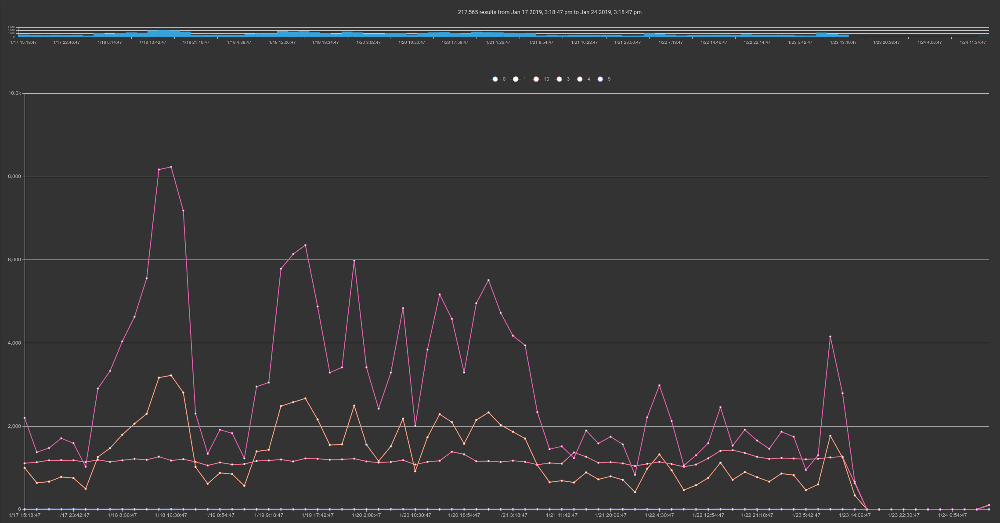
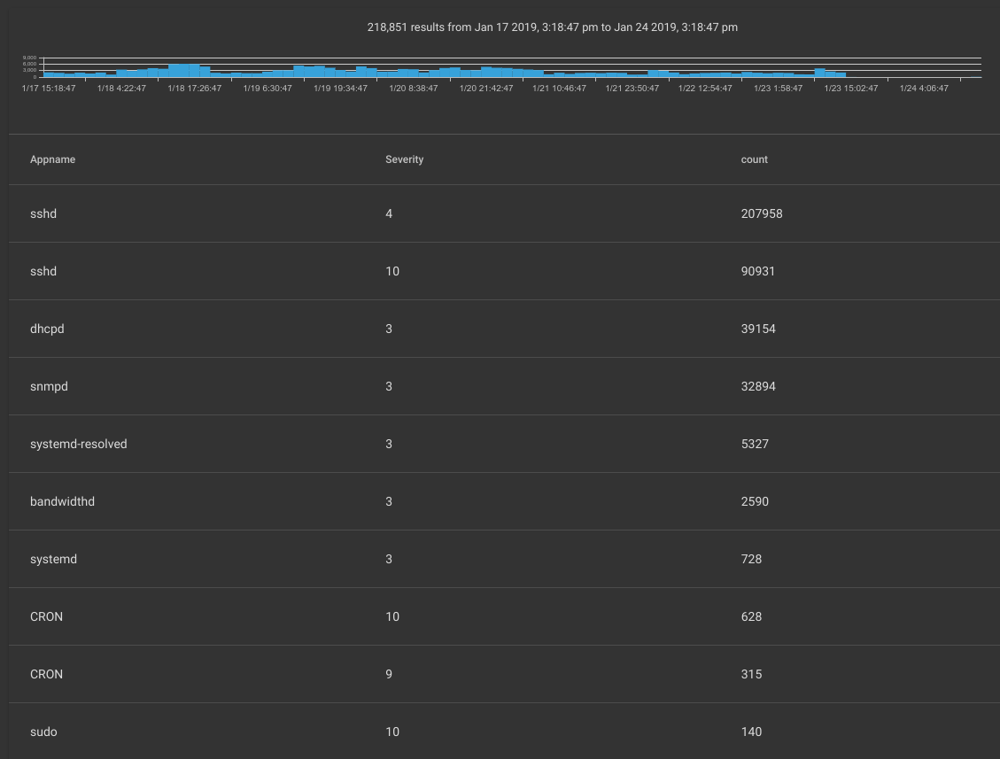

# Syslog

syslogプロセッサは、[RFC 5424形式](https://tools.ietf.org/html/rfc5424)の syslogメッセージから[Simple Relayインジェスタ](#!ingesters/ingesters.md)を使って取り込まれたフィールドを抽出します（必ずリスナーにKeep-Priorityフラグを設定しないと、機能しません）。

## サポートされているオプション

* `-e`: “ -e”オプションは、syslogモジュールが列挙値で動作するように指定します。  列挙値を操作すると、アップストリームモジュールを使用してsyslogレコードを抽出した場合に便利です。  たとえば、生のPCAPからsyslogレコードを抽出し、そのレコードをsyslogモジュールに渡すことができます。

## 処理オペレータ

各syslogフィールドは、高速フィルタとして機能できる一連の演算子をサポートします。  各演算子でサポートされているフィルタは、フィールドのデータ型によって決まります。

| オペレーター | 名 | 説明
|----------|------|-------------
| == | 等しい | フィールドは等しくなければなりません
| != | 等しくない | フィールドは等しくてはいけません
| < | 未満 | フィールドはより小さい
| > | より大きい | フィールドはより大きくなければなりません
| <= | 以下 | フィールドは以下でなければなりません
| >= | 以上 | フィールドは以上でなければなりません
| ~ | サブセット | フィールドはメンバーでなければなりません
| !~ | サブセットではない | フィールドはメンバーであってはいけません

## データフィールド

Tsyslogモジュールは、RFC 5424形式のsyslogレコードから個々のフィールドを抽出します。  左から右に解析するベストエフォートの試みを行います。 つまり、フィールドが欠落している場合、そのレコードの右側にあるフィールドのみが利用可能になります。

| フィールド | 説明 | サポートされている演算子 | 例 |
|-------|-------------|---------------------|---------|
| Facility | メッセージの発信元のファシリティを示す数値コード | > < <= >= == != | Facility == 0
| Severity | メッセージの重要度を示す数値コード。 0が最も重要度が高く、7が最も重要度が低くなります。 | > < <= >= == != | Severity < 3
| Priority | メッセージの優先順位。（20 * Facility）+ Severityとして定義されます。 | > < <= >= == != | Priority >= 100
| Version | 使用中のsyslogプロトコルのバージョン | > < <= >= == != | Version != 1
| Timestamp | ログメッセージで提供されたタイムスタンプの文字列表現 | == != | |
| Hostname | 最初にsyslogメッセージを送信したマシンのホスト名 | == != | Hostname != "myhost"
| Appname | syslogメッセージを最初に送信したアプリケーション、例えば`systemd` | == != | Appname != "dhclient"
| ProcID | メッセージを送信したプロセスを表す文字列。しばしばPID | == != | ProcID != "7053"
| MsgID | メッセージの種類を表す文字列 | == != | MsgID == "TCPIN"
| Message | ログメッセージ自体 | == != | Message == "Critical error!" |
| StructuredID | 構造化データ要素の構造化データIDを含む文字列（下記参照） | == != | StructuredID == "ourSDID@32473"

次のsyslogレコードを考えてみましょう。(ソース:[https://github.com/influxdata/go-syslog](https://github.com/influxdata/go-syslog)):

```
<165>4 2018-10-11T22:14:15.003Z mymach.it e - 1 [ex@32473 iut="3" foo="bar"] An application event log entry...
```

syslogモジュールは以下のフィールドを抽出します:

* Facility: 20
* Severity: 5
* Priority: 165
* Version: 4
* Timestamp: "2018-10-11T22:14:15.003Z"
* Hostname: "mymach.it"
* Appname: "e"
* ProcID: <nil> (not set)
* MsgID: "1"
* Message: "An application event log entry..."

`[ex @ 32473 iut =" 3 "foo =" bar "]`の部分は* Structured Data *セクションです。  構造化データセクションには、構造化値ID（"ex @ 32473"、"StructuredID"キーワードで抽出）および任意の数のキーと値のペアが含まれます。  syslogモジュールを使用して値にアクセスするには、キーを指定します。 `syslog iut`を実行すると、値"3"を含む`iut`という名前の列挙値が設定されます。 同様に、`syslog StructuredID foo`は"ex @ 32473"を含む`StructuredID`と"bar"を含む`foo`を抽出します。

## 例

### 重大度別のイベント数

```
tag=syslog syslog Severity | count by Severity | chart count by Severity
```



### アプリケーションごとの重大度別のイベント数

```
tag=syslog syslog Appname Severity | count by Appname,Severity | table Appname Severity count
```

