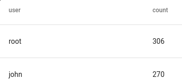

# Table

テーブルレンダラーはテーブルを作成するために使用されます。  テーブルを構築するには、テーブルレンダラーに引数を渡します。  引数は列挙値、TAG、TIMESTAMP、またはSRCでなければなりません。  引数はテーブルの列として使用されます。

列引数を指定しないと、tableはすべての列挙値を列として表示します。  これは調査に役立ちます。

## サポートされているオプション

* `-save <destination>`: 結果のテーブルをlookupモジュール用のリソースとして保存します。  これは、ある検索の結果を保存し（DHCPログからMACからIPへのマッピングを抽出するなど）、後の検索で使用するのに便利な方法です。
* `-csv`: -saveフラグと組み合わせて、ネイティブのGravwell形式ではなくCSV形式でテーブルを保存します（CSVはルックアップモジュールとも互換性があります）。 データをエクスポートするときに便利です。
* `-update <key>`: `-save`フラグと組み合わせて、既存のテーブルを上書きするのではなく更新します。 これは、スケジュール検索を使用して、たとえば ネットワークでこれまでに見られたすべてのMACアドレスのリスト。 既存のルックアップテーブルの列は、引数として指定された列と一致する必要があります。 "key"オプションは、いずれかの列の名前です。 古いルックアップテーブルと新しいルックアップテーブルをマージするとき、古いテーブルの行は、そのキー付き列の値が新しいテーブルに存在しない場合にのみ含まれます。
* `-nt`: テーブルをnon-temporalモードにします。 これにより、上流の数学モジュールは、テーブルに実行させるのではなく、結果を圧縮します。 これにより、一時的な副選択が不要な場合に、大量のデータの検索を大幅に高速化できます。 現在、[stats module](#!search/stats/stats.md)を使用する場合にも必要です。

## サンプルクエリ

### 基本テーブル用

Netflowレコードからいくつかの要素を抽出して、テーブルにそれらを自動的に表示させます:

```
tag=netflow netflow Src Dst SrcPort DstPort | table
```

ブルートフォースSSH攻撃を見つける:

```
tag=syslog grep sshd | regex "authentication error for (?P<user>\S+)" | count by user | table user count
```



### -ntオプションを使用する

大量のデータがある状況では、countモジュールが代わりに結果を圧縮するように、tableをnon-temporalモードに強制します:

```
tag=jsonlogs json source | count by source | table -nt source count
```

### -saveオプションを使用する

DHCPログを使用して、IPからMACへのマッピングを含むルックアップテーブルを作成します:

```
tag=syslog regex "DHCPACK on (?P<ip>\S+) to (?P<mac>\S+)" | unique ip mac | table -save ip2mac ip mac
```

そして、ルックアップテーブルを使ってSSHログインに関連するMACを見つけます:

```
tag=syslog grep sshd | regex "Accepted .* for (?P<user>\S+) from (?P<ip>\S+)" | lookup -r ip2mac ip ip mac as mac |table user ip mac
```


### -updateオプションを使用する

この例では、ローカルネットワークで見られるIPアドレスを含むテーブルを作成し、さらに更新します。

最初に、192.168.2.0/24ネットワークで見られる一意のプライベートIPv4アドレスをすべて含むテーブルを作成します。

```
tag=pcap packet ipv4.SrcIP ~ PRIVATE | unique SrcIP | subnet SrcIP /24 | eval subnet == toIP("192.168.2.0") | table -save test -csv SrcIP
```


結果のリソース（'test'という名前）をダウンロードすると、予想されるテーブルが表示されます。:

```
SrcIP
192.168.2.1
192.168.2.52
192.168.2.60
192.168.2.51
192.168.2.61
```

次に、192.168.0.0/24サブネットで見られるIPを*追加*するために別の検索を実行します:

```
tag=pcap packet ipv4.SrcIP ~ PRIVATE | unique SrcIP | subnet SrcIP /24 | eval subnet == toIP("192.168.0.0") | table -update SrcIP -save test -csv SrcIP
```


*表示*されているテーブルには新しいIPアドレスのみが表示されていますが、リソースには両方の検索結果が含まれています:

```
SrcIP
192.168.0.50
192.168.0.60
192.168.0.1
192.168.0.71
192.168.0.30
192.168.0.2
192.168.0.73
192.168.0.70
192.168.0.42
192.168.0.72
192.168.2.1
192.168.2.52
192.168.2.60
192.168.2.51
192.168.2.61
```

updateの引数として'SrcIP'を渡しました。これは重複排除に使用されます。 SrcIPが新しいテーブルの行と一致する古いテーブルの行は、更新されたリソースに含まれません。
