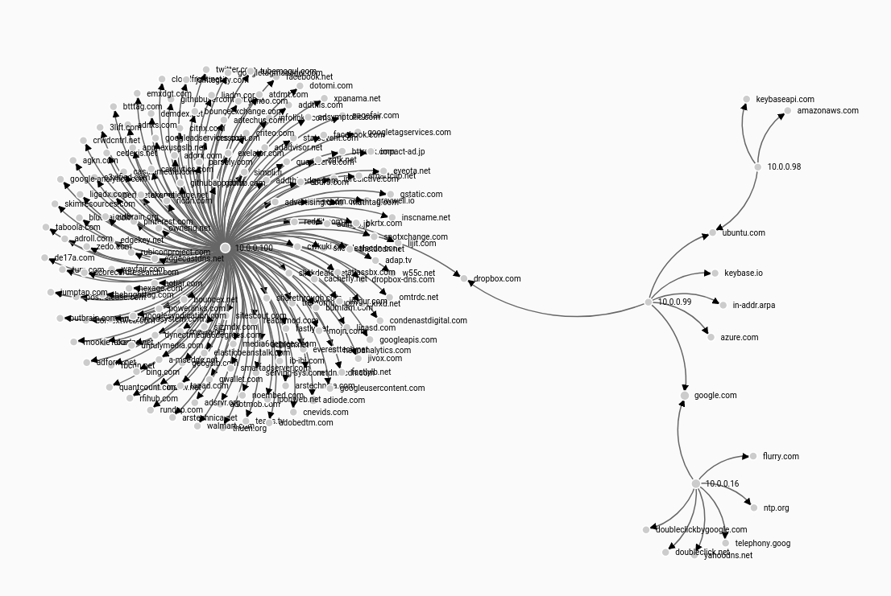
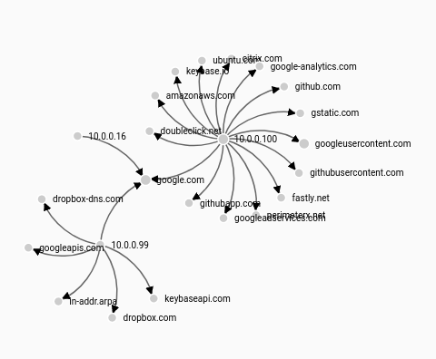

 
## Taint

汚染モジュールは汚染分析とフロートラッキングに使用されます。  このモジュールを使用して、既知の開始点を指定してから「感染」を伝播させることができます。  Taintは感染の終点を特定し、発生点を特定するのに間に合うように逆方向に作業するためにも使用できます。  汚染モジュールは検索システムの方向を逆にする能力を持っています。  たとえば、汚染が既知の患者ゼロから開始しようとしている場合、検索は時間ウィンドウの最初から開始され、時間的に前に進みます。  しかし、汚染が既知の感染で始まり、患者ゼロを見つけるために逆方向に作業している場合は、検索は時間枠の最後から開始して逆方向に移動します。 

汚染は、ソースからデスティネーションまでの汚染値を追跡するために列挙値を必要とします。  汚染するソースとデスティネーションの引数は、任意の名前付き列挙値にすることができます。  時間をずらして（患者ゼロから始めて）進むと、汚染モジュールはsource引数で指定された列挙値を探し、その値を抽出します。  ソース値が汚染されているとマークされている場合（患者ゼロ引数を介して、または前回の汚染のために）、デスティネーション値は汚染されているとマークされます。

汚染追跡は、逆に実行することもできます。  既知の感染ポイントから始めて、-fフラグを使用して時間をずらして作業することもできます。  sourceとdestinationの引数の関係は依然として保持されているため（sourceはdestinationに影響を与えます）、-f vs -pzを使用する場合はsourceとdestinationの列挙値の名前を逆にする必要があります。  

汚染追跡のプロセスは、マークを時間の前後に伝播するように設計されています。  たとえば、Aが汚染されていて、AがBに接触し、BがCに接触するのを見た場合、A、B、Cのいずれかが汚染されていると見なされます。


汚染モジュールは、ネットワークフローの伝播、感染の伝播、または物理システムの移動を追跡するために使用できます。  たとえば、ICMP伝播を追跡している場合、送信元の列挙値は "SrcIP"、送信先の引数は列挙値 "DstIP"になります。

Gravwellは、マイアミで開催されたS4x18カンファレンスで、[hopped air gaps](https://s4x18.com/sessions/using-force-directed-graphs-to-analyze-huge-event-datasets/)USBベースの感染者の追跡に成功した研究を発表しました。

重要：taintは検索の方向を制御できるため、これをsortモジュールと組み合わせることはお勧めできません。

### 構文

汚染モジュールのコマンド構文は、強制有向グラフに似ています。  フローが双方向かどうかを示すフラグを使用して送信元と宛先を指定する必要があります。  患者ゼロ（-pz）でも既知の感染（-f）でも、開始点が必要です。

#### 患者ゼロから始める
```
taint -pz <known value> <src> <dest>
```

#### 既知のエンドポイントから開始
```
taint -f <known value> <src> <dest>
```

### サポートされているオプション
* `-pz <arg>`: -pzフラグは、患者ゼロ（開始点）の値を指定します。  汚れは 汚染を開始するための患者ゼロ値の列挙値。
* `-f <arg>`: -fフラグは、既知の感染に対する値を指定します。  Taintは、で指定された列挙値を調べます。   既知の感染した価値のためにそして汚染を追跡し始めなさい。  
-b注：-bフラグは、感染が双方向であることを指定し、どちらかの側が過去に汚染されていた場合、その汚染はもう一方に転送されます。
* `-a`: -aフラグは、すべてのエントリが汚染モジュールを通過するように指定します。  つまり、汚染モジュールは、汚染値を含まないエントリを削除しません。

### 例

ルックアップキャッシュにペイロードを埋め込むことによってDNSサーバーに任意に感染する可能性がある悪質な新しい感染経路が見つかったとしたら、taintモジュールを使ってどのトップレベルドメイン名が攻撃されたのかを特定できます。  次の検索は、既知の患者ゼロから開始し、小規模ネットワーク内の汚染ドメインの将来のすべての伝播を示す強制有向グラフを生成します。

```
tag=dns json Remote Answer.Hdr.Name |  regex -e Name "(?P<tld>[^\.]+\.[^\.]+)\.$" | regex -e Remote "(?P<ip>[\d\.]+):\d+" | taint -b -pz 10.0.0.99 ip tld | fdg -b ip tld
```



ワークフローを逆にすると、次の検索は、ハンターが既知の感染から始めて、潜在的な患者ゼロに向かって逆方向に作業する方法を示しています。

```
tag=dns json Remote Answer.Hdr.Name |  regex -e Name "(?P<tld>[^\.]+\.[^\.]+)\.$" | regex -e Remote "(?P<ip>[\d\.]+):\d+" | taint -b -f google.com tld ip | fdg -b ip tld
```


